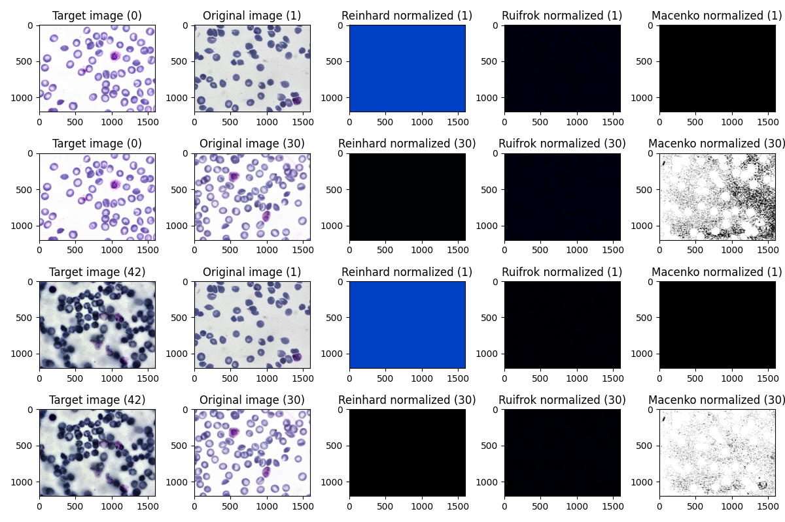
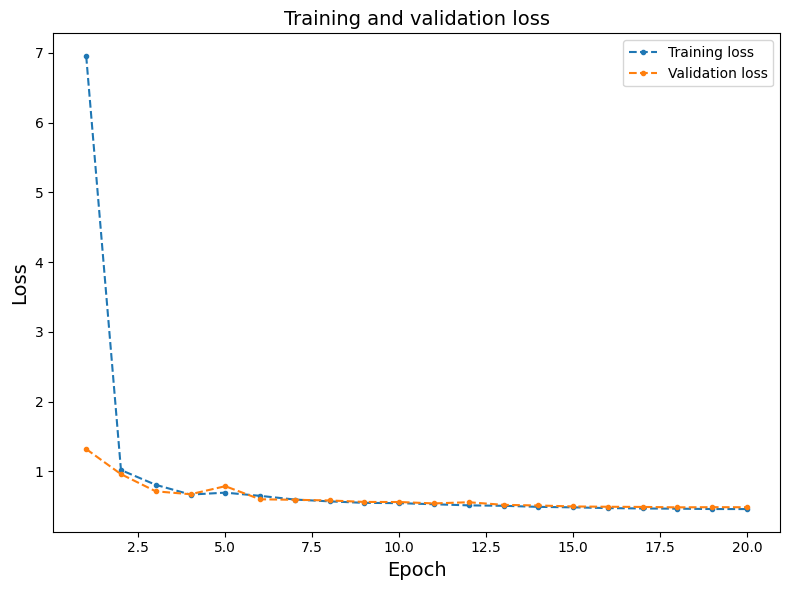

# Microscopic blood cell segmentation

# 1. Preprocessing

## 1.1 Stain normalization

Over-normalization was observed as all three stain normalization methods generated nearly uniform-colored images or lost most of the original features (**figure 1**). This effects may be due to bad selection of reference image, or the method being too aggressive. Therefore, I proceeded without stain normalization in subsequent analysis.



**Figure 1.** Stain normalized images using different algorithms and choices of target images (image 0 and 42 in the training data). Randomly display normalized results of 2 images from training set, indexed as 1 and 30.

# 2. Model training

Since UNI is based on large vision transformer (ViT-Large) model, I selected ViT-B model which also belongs to the ViT family but is smaller. This task is less complicated compared to processing histology slides, therefore simpler ViT models such as ViT-B can still produce high-quality results while requiring fewer resources.

The segmentation head used is Mask R-CNN, a well-tested model for instance segmentation. The overall architecture of my model is:

```
ViT-B (encoder) + Mask R-CNN (instance segmentation head)
```

Choices of hyperparameters are summarized as below. The epoch number is small to cut down the running time, and no further tuning was tested due to limit of time.

```
NUM_EPOCHS = 20      # Epoch
BATCH_SIZE = 16      # Same as the UNI paper
LR         = 1e-3    # Learning rate
```

Other details of the model setup include:

- Data registration: Images and masks were converted to COCO json format for standardized handling by the model.
- Data split: The BCCD dataset was already split into training (N=1169) and test (N=159). I further split the original training set randomly into training (70%) and validation (30%).
- Training scripts were executed in Google Colab to take advantage of the GPU acceleration.

# 3. Data visualization

Total loss for both training and test sets over epoch is displayed in **figure 2**. Since the number of epoch was small, the loss was still decreasing in both training and validation sets at the last epoch, suggesting additional epochs is needed for training to optimize hyperparameters and further improve model performance.



**Figure 2.** Change of total loss over epoch in training and validation sets

Model performance is evaluated in the test set by IoU, mAP (mean Average Precision) and Dice in **figure 3**. Specifically, IoU measures the boundary accuracy, Dice checks for pixel-level accuracy, and mAP (mean Average Precision) is good for evaluation of object-level correctness. Higher values for all three metrics indicate better prediction. As expected, checkpoints in later epochs achieved higher IoU and mAP as they are better optimized. However, the Dice score remained 1 across all epochs, likely due to incorrect settings rather than true model performance (**figure 3**).


**Figure 3.** Model performance in test set evaluated by IoU, mAP and Dice over epoch

# 4. Quantitative results

Model performance measured by IoU, Dice over epoch mAP. 

| **epoch** | **IoU** | **mAP** | **Dice** |
| --- | --- | --- | --- |
| 1 | 0.7918 | 0.5016 | 1.0 |
| 2 | 0.8316 | 0.6455 | 1.0 |
| 3 | 0.7657 | 0.7098 | 1.0 |
| 4 | 0.859 | 0.7266 | 1.0 |
| 5 | 0.8561 | 0.7035 | 1.0 |
| 6 | 0.8572 | 0.7377 | 1.0 |
| 7 | 0.8594 | 0.7324 | 1.0 |
| 8 | 0.8649 | 0.7438 | 1.0 |
| 9 | 0.8694 | 0.7402 | 1.0 |
| 10 | 0.858 | 0.7368 | 1.0 |
| 11 | 0.8701 | 0.7488 | 1.0 |
| 12 | 0.8635 | 0.7332 | 1.0 |
| 13 | 0.8695 | 0.7505 | 1.0 |
| 14 | 0.8688 | 0.7461 | 1.0 |
| 15 | 0.8703 | 0.7462 | 1.0 |
| 16 | 0.8705 | 0.7503 | 1.0 |
| 17 | 0.8719 | 0.7445 | 1.0 |
| 18 | 0.8698 | 0.748 | 1.0 |
| 19 | 0.8714 | 0.7514 | 1.0 |
| 20 | 0.8719 | 0.753 | 1.0 |

**Table 1.** Contains the same values used to create figure 3.

# 5. Challenges and potential improvements

## 5.1 Preprocessing

I tested stain normalization and observed over-normalization of the images. This may have been caused by inappropriate selection of the reference image or the normalization algorithms being too aggressive. Other preprocessing approaches, such as patch extraction and image augmentation, are worth testing. Both methods can increase the size of training data and thus improve the model performance. However, extra care is always needed as preprocessing can also introduce artifacts or bias. For example, the choice of patch size is highly relevant to the object of interest. Therefore, preprocessing procedures need to be customized within the context of each project.

## 5.2 Model building and training

While most state-of-art models are available from existing libraries, one of the biggest challenge I encountered was the lacking of consistent frameworks for the specific task. Particularly, version compatibility often hinders the construction of desired architectures.

Additionally, although I did not test for different combinations of hyperparameters, extra tuning is often critical. For example, we can change learning rate, epoch, etc., using grid search or more advanced methods such as Bayesian optimization.

## 5.3 Application and adaptation

The UNI model introduced by Chen et.al aimed to provide a encoder pretrained on large-scale histology image datasets. However, to achieve optimal performance on in-house datasets, fine-tuning is necessary. Generating high-quality and sufficiently-large dataset for fine-tuning can be both time- and resource-consuming, and often requires on massive collaboration and domain expertise.

# 6. Code availability

Scripts, model configurations and plots can be found here:

[https://drive.google.com/drive/folders/1qfrnSWnLpjB9mNPJqGK50MUCmyHR40h2?usp=sharing](https://drive.google.com/drive/folders/1qfrnSWnLpjB9mNPJqGK50MUCmyHR40h2?usp=sharing)
